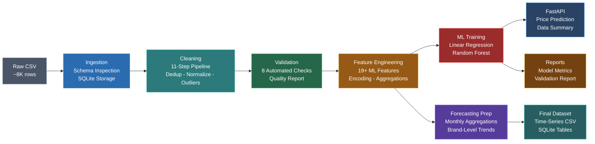

# Automotive Data Preparation & Forecasting Pipeline

A production-ready data engineering and machine learning pipeline that ingests, cleans, validates, transforms, and models used-car listing data for price prediction and demand forecasting.

---

## Project Overview

### Business Problem

An online car marketplace needs to analyze used-car listings and prepare high-quality data for machine learning models that can predict car prices, market trends, and demand patterns. Raw listing data is noisy, inconsistent, and not ML-ready — this pipeline solves that.

### What This Pipeline Does

1. **Ingests** raw used-car listing data (CSV → SQLite)
2. **Cleans** data (deduplication, normalization, outlier handling)
3. **Validates** data quality with automated checks
4. **Engineers** 19+ ML-ready features
5. **Prepares** time-series forecasting datasets
6. **Trains** baseline ML models (Linear Regression + Random Forest)
7. **Serves** predictions via a REST API (FastAPI)

---

## Project Structure

```
automotive-data-pipeline/
│
├── data/
│   ├── raw/                    # Raw CSV input
│   ├── processed/              # Cleaned data + ML features
│   └── final/                  # Forecasting datasets
│
├── notebooks/                  # Exploration notebooks
│
├── src/
│   ├── config.py               # Central configuration
│   ├── generate_dataset.py     # Synthetic data generator
│   ├── ingestion/
│   │   └── ingest.py           # CSV loading + DB storage
│   ├── cleaning/
│   │   └── clean.py            # 11-step cleaning pipeline
│   ├── validation/
│   │   └── validate.py         # 8 automated quality checks
│   ├── transformation/
│   │   └── transform.py        # Pipeline orchestrator
│   ├── features/
│   │   ├── engineer_features.py  # Feature engineering
│   │   └── prepare_forecasting.py # Time-series preparation
│   ├── modeling/
│   │   └── train_model.py      # ML baseline training
│   └── api/
│       └── app.py              # FastAPI application
│
├── sql/
│   ├── create_tables.sql       # Database schema
│   └── sample_queries.sql      # Analytical queries
│
├── models/                     # Saved model artifacts
├── reports/                    # Validation + ML reports
├── tests/                      # Unit tests
│
├── run_pipeline.py             # One-click pipeline runner
├── requirements.txt
├── Dockerfile
├── docker-compose.yml
└── README.md
```

---

## Dataset

The pipeline uses a synthetic dataset of ~8,000 used-car listings modeled after European market data. The dataset is generated automatically on first run.

**Columns:**

| Column | Type | Description |
|--------|------|-------------|
| name | string | Car brand and model name |
| year | int | Production/purchase year |
| selling_price | float | Selling price in EUR |
| km_driven | int | Total kilometers driven |
| fuel | string | Fuel type (Petrol, Diesel, CNG, LPG, Electric) |
| seller_type | string | Individual, Dealer, or Trustmark Dealer |
| transmission | string | Manual or Automatic |
| owner | string | Ownership history |
| listing_date | date | Date the car was listed (synthetic) |

The synthetic data includes realistic correlations (luxury brands → higher prices, older cars → more mileage) and intentional noise (~3% missing values, ~2% duplicates, outliers) to demonstrate the cleaning pipeline.

---

## Pipeline Architecture



> All intermediate results are stored in both **CSV files** and a **SQLite database** at each stage.

---

## Data Cleaning Steps

1. **Remove duplicate records** — Exact duplicate elimination
2. **Standardize column names** — Snake_case normalization
3. **Split car name** — Extract brand and model from name
4. **Normalize text** — Title case, whitespace trimming
5. **Handle missing values** — Median (numeric), mode (categorical)
6. **Remove invalid years** — Filter out year < 1990 or > current year
7. **Remove invalid mileage** — Filter negative or > 1M km
8. **Price outlier detection** — IQR method with capping
9. **Standardize categories** — Map to valid fuel, transmission, seller, owner types
10. **Generate listing dates** — Synthetic dates for time-series features
11. **Add unique IDs** — Sequential listing_id assignment

---

## Feature Engineering

| Feature | Description |
|---------|-------------|
| `car_age` | Current year minus production year |
| `mileage_per_year` | km_driven / car_age |
| `log_price` | Log-transformed selling price |
| `log_mileage` | Log-transformed mileage |
| `price_segment` | Quartile-based segmentation (Budget/Economy/Mid-Range/Premium) |
| `mileage_bucket` | Binned mileage (Low/Medium/High/Very High) |
| `brand_average_price` | Mean price by brand |
| `model_average_price` | Mean price by model |
| `fuel_type_encoded` | Label-encoded fuel type |
| `transmission_encoded` | Label-encoded transmission |
| `seller_type_encoded` | Label-encoded seller type |
| `owner_type_encoded` | Label-encoded owner type |
| `listing_month` | Month extracted from listing date |
| `listing_year` | Year extracted from listing date |
| `listing_season` | Season derived from month |
| `monthly_average_price` | Average price in listing month |
| `monthly_listing_count` | Number of listings in month |
| `brand_monthly_average_price` | Brand-level monthly avg price |
| `brand_monthly_listing_count` | Brand-level monthly listing count |

---

## Forecasting Dataset

A separate time-series dataset is prepared for demand and price forecasting:

- **Monthly aggregation**: Average price, listing count, average mileage per month
- **Brand-monthly aggregation**: Same metrics grouped by brand

Output: `data/final/automotive_monthly_forecasting_dataset.csv`

---

## ML Baseline Results

Two baseline models are trained for price prediction:

| Model | MAE (EUR) | RMSE (EUR) | R2 Score |
|-------|-----------|------------|----------|
| Linear Regression | 1,023 | 1,418 | 0.7758 |
| **Random Forest** | **640** | **1,077** | **0.8707** |

Best model: **Random Forest** (automatically saved to `models/best_model.pkl`).

---

## API Usage

### Start the API

```bash
uvicorn src.api.app:app --reload --port 8000
```

### Endpoints

**GET /** — Project info
```bash
curl http://localhost:8000/
```

**GET /health** — Health check
```bash
curl http://localhost:8000/health
```

**POST /predict-price** — Predict car price
```bash
curl -X POST http://localhost:8000/predict-price \
  -H "Content-Type: application/json" \
  -d '{
    "year": 2018,
    "km_driven": 45000,
    "fuel": "Petrol",
    "transmission": "Manual",
    "seller_type": "Individual",
    "owner": "First Owner",
    "brand": "Maruti",
    "model": "Swift"
  }'
```

**GET /data-summary** — Dataset statistics
```bash
curl http://localhost:8000/data-summary
```

---

## How to Run

### Run Locally

```bash
# Clone the repository
git clone https://github.com/yourusername/automotive-data-pipeline.git
cd automotive-data-pipeline

# Create virtual environment
python -m venv venv
venv\Scripts\activate  # Windows
# source venv/bin/activate  # Linux/Mac

# Install dependencies
pip install -r requirements.txt

# Run the complete pipeline
python run_pipeline.py

# Start the API server
uvicorn src.api.app:app --reload --port 8000
```

### Run with Docker

```bash
# Build and start
docker-compose up --build

# API will be available at http://localhost:8000
```

### Run Tests

```bash
pytest tests/ -v
```

---

## Database

The pipeline uses SQLite with these tables:

| Table | Description |
|-------|-------------|
| `raw_car_listings` | Original ingested data |
| `cleaned_car_listings` | Cleaned and normalized data |
| `ml_features` | Engineered features for ML |
| `monthly_forecasting_data` | Monthly aggregated time series |
| `brand_monthly_forecasting_data` | Brand-level monthly time series |

SQL scripts are available in the `sql/` folder.

---

## Tech Stack

- **Python** — Core language
- **Pandas & NumPy** — Data manipulation and transformation
- **Scikit-learn** — Machine learning models
- **FastAPI** — REST API framework
- **SQLite** — Lightweight database
- **Docker** — Containerization
- **Pytest** — Testing framework

---

## Resume-Ready Bullet Points

- Built an end-to-end automotive data engineering pipeline in Python and SQL to ingest, clean, validate, and transform used-car listing data for machine learning and forecasting use cases.
- Performed data cleaning, missing-value handling, outlier detection, brand/model normalization, and feature engineering using Pandas and NumPy.
- Designed ML-ready features including car age, mileage per year, price segment, brand-level statistics, and time-based aggregates for price and demand prediction.
- Created monthly forecasting datasets and baseline machine learning models using Scikit-learn, evaluated with MAE, RMSE, and R².
- Integrated the trained model into a FastAPI service and containerized the project with Docker for reproducible deployment.

---

## License

This project is for educational and portfolio purposes.
